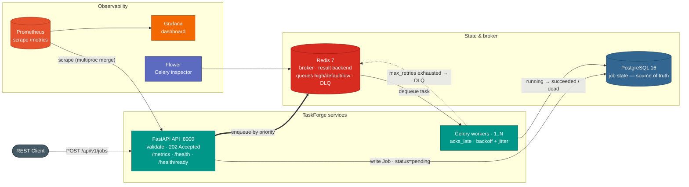

# TaskForge

Async background job processing system: FastAPI submits jobs, Celery workers execute them, PostgreSQL tracks state, Redis brokers the queue, and Prometheus/Grafana expose what's happening.

[](https://github.com/JaithraSarma/TaskForge/actions/workflows/ci.yml)
[](LICENSE)

---

## Architecture



Request flow:

1. Client submits a job via `POST /api/v1/jobs` (type, payload, priority, max_retries).
2. FastAPI validates the payload, writes a `Job` row to PostgreSQL (`status=pending`), and returns `202 Accepted` immediately — the client never waits on the actual work.
3. The task is published to Redis. Priority (1-10) maps to one of three Celery queues: `high` (1-3), `default` (4-7), `low` (8-10).
4. A Celery worker dequeues the task, flips the row to `running`, and dispatches to the handler for that `job_type`.
5. On success: `status=succeeded`, result written back to the row.
6. On failure: retried with exponential backoff + jitter until `max_retries` is exhausted, then `status=dead` and the job is pushed onto the Redis dead-letter queue.
7. Prometheus scrapes `/metrics` on the API; the API also aggregates metrics written by the worker processes via a shared multiprocess directory. Grafana renders it all.

PostgreSQL is the source of truth for job state; Redis only holds in-flight queue messages and the DLQ list.

---

## Why it's built this way

- **`task_acks_late=True` + `task_reject_on_worker_lost=True`** (`worker/celery_app.py`) — Celery's default is to ack (delete) a message before running it, so a worker that gets OOM-killed mid-task loses the job silently. Acking late means the message stays on the broker until the task actually finishes; if the worker dies, Redis redelivers it to another worker instead of dropping it.
- **asyncpg for the API, psycopg2 for the workers** — the API is an async FastAPI app (`app/database.py` uses `create_async_engine` + asyncpg) so a slow query doesn't block the event loop. Celery's prefork worker pool is synchronous, so `worker/tasks.py` uses a plain psycopg2 engine instead — mixing an async driver into a sync worker process doesn't work. Two separate `DATABASE_URL` / `DATABASE_URL_SYNC` settings keep this explicit rather than papered over.
- **Priority routing over a single queue** (`app/api/router.py::_priority_to_queue`) — numeric priority 1-10 is mapped to `high`/`default`/`low` Celery queues at submit time, so a burst of low-priority `data_export` jobs can't starve time-sensitive `email_notification` jobs.
- **Exponential backoff with jitter** (`worker/tasks.py::process_job`) — retry delay is `2^retry_count * retry_base_delay + random(0, 1)`. Plain exponential backoff still causes every failed job to retry in lockstep; the jitter term spreads retries out so a downstream outage doesn't get hit by a synchronized thundering herd when it comes back.
- **Dead-letter queue** — once `retry_count > max_retries`, the job is marked `dead` in PostgreSQL and pushed as JSON onto a Redis list (`taskforge-dlq`, db 2). The DLQ API (`/api/v1/dlq`) lets you inspect the payload and traceback, retry the job (resets state and re-enqueues), or purge it — without digging through worker logs.
- **Liveness vs. readiness** — `GET /health` always returns 200 if the process is up; it says nothing about dependencies. `GET /health/ready` actually pings PostgreSQL (`SELECT 1`) and Redis (`PING`) and returns 503 if either is unreachable. Kubernetes uses `/health` to decide whether to restart the container and `/health/ready` to decide whether to send it traffic — conflating the two means a pod with a dead DB connection still gets requests routed to it.
- **Multiprocess Prometheus registry** — the API runs with `--workers 2` and the worker runs with `--concurrency 4`; `prometheus_client`'s default registry is per-process and doesn't aggregate across any of that. `PROMETHEUS_MULTIPROC_DIR` makes every process write to a shared directory (a Docker volume in compose, an `emptyDir` in k8s), and the API's `/metrics` endpoint uses `MultiProcessCollector` to merge them into one scrape — this is also how worker-side counters (job duration, retries, DLQ size) reach Prometheus at all, since the worker has no HTTP surface of its own. Stale `.db` files from a previous run are cleaned up on API startup.

---

## Tech stack

| Layer | Technology |
|---|---|
| API framework | FastAPI 0.115, Uvicorn, Pydantic v2 |
| Task queue | Celery 5.4, Redis 7 (broker + result backend + DLQ) |
| Database | PostgreSQL 16, SQLAlchemy 2.0 (asyncpg for the API, psycopg2 for workers), Alembic |
| Metrics | prometheus-client, prometheus-fastapi-instrumentator, Prometheus, Grafana |
| Monitoring UI | Flower (Celery task/worker inspector) |
| Containers | Docker, Docker Compose, Kubernetes manifests |
| CI/CD | GitHub Actions (lint, type check, test, build), GHCR, Trivy |
| Quality tooling | ruff, mypy, pytest + pytest-asyncio + pytest-cov |
| Language | Python 3.10 |

---

## Quick start (Docker Compose)

```bash
git clone https://github.com/JaithraSarma/TaskForge.git
cd TaskForge

cp .env.example .env
docker compose up -d --build
docker compose ps          # everything should show "healthy"

pip install httpx
python scripts/seed_jobs.py
```

| Service | URL | Notes |
|---|---|---|
| API docs (Swagger) | http://localhost:8000/docs | interactive |
| API docs (ReDoc) | http://localhost:8000/redoc | |
| Grafana | http://localhost:3000 | login `admin` / `admin` |
| Prometheus | http://localhost:9090 | |
| Flower | http://localhost:5555 | Celery task/worker inspector |

See [SETUP.md](SETUP.md) for a step-by-step runbook with expected output at each stage, local (non-Docker) development, running tests, and troubleshooting.

---

## Kubernetes

`k8s/` has plain manifests mirroring the compose topology: a `taskforge-api` Deployment (2 replicas, HPA-scaled on CPU), a `taskforge-worker` Deployment, a Postgres `StatefulSet` with a PVC, a Redis `Deployment`, a `ConfigMap`/`Secret` pair, and probes wired to `/health` and `/health/ready`. See [k8s/README.md](k8s/README.md) for prerequisites, how to load the image into a local cluster (kind/minikube), and apply order.

```bash
docker build -t taskforge:latest .
kind load docker-image taskforge:latest
kubectl apply -f k8s/
kubectl -n taskforge port-forward svc/taskforge-api 8000:8000
```

---

## API reference

### Jobs — `/api/v1/jobs`

| Method | Endpoint | Description |
|---|---|---|
| `POST` | `/api/v1/jobs` | Submit a new job — returns `202` |
| `GET` | `/api/v1/jobs` | List jobs (paginated, filterable by `status` / `job_type`) |
| `GET` | `/api/v1/jobs/{id}` | Get full job detail |
| `DELETE` | `/api/v1/jobs/{id}` | Cancel a job — only while it's still `pending` (`409` otherwise) |

### Dead-letter queue — `/api/v1/dlq`

| Method | Endpoint | Description |
|---|---|---|
| `GET` | `/api/v1/dlq` | List DLQ entries (paginated) |
| `GET` | `/api/v1/dlq/{id}` | Inspect a DLQ entry (payload, error, retry count) |
| `POST` | `/api/v1/dlq/{id}/retry` | Reset the job to `pending` and re-enqueue it |
| `DELETE` | `/api/v1/dlq/{id}` | Permanently delete a DLQ entry |

### System

| Method | Endpoint | Description |
|---|---|---|
| `GET` | `/health` | Liveness — process is up, no dependency checks |
| `GET` | `/health/ready` | Readiness — checks PostgreSQL + Redis, `503` if either is down |
| `GET` | `/metrics` | Prometheus exposition format |

### Example: submit a job

```bash
curl -X POST http://localhost:8000/api/v1/jobs \
  -H "Content-Type: application/json" \
  -d '{
    "job_type": "email_notification",
    "payload": {"to": "user@example.com", "subject": "Hello"},
    "priority": 2,
    "max_retries": 5
  }'
```

```json
{
  "id": "a1b2c3d4-e5f6-7890-abcd-ef1234567890",
  "status": "pending",
  "message": "Job submitted successfully"
}
```

### Job types

Handlers in `worker/handlers.py` simulate real work with a randomized failure rate, so retries and the DLQ actually get exercised without external dependencies:

| `job_type` | Simulated failure rate |
|---|---|
| `email_notification` | ~10% |
| `data_export` | ~5% |
| `image_resize` | ~8% |
| `webhook_delivery` | ~12% |

---

## Observability

Metrics defined in `app/metrics.py`, exported at `/metrics`:

| Metric | Type | Labels | Meaning |
|---|---|---|---|
| `taskforge_jobs_submitted_total` | Counter | `job_type`, `priority` | Jobs accepted via the API |
| `taskforge_jobs_completed_total` | Counter | `job_type`, `status` | Jobs reaching a terminal state (`succeeded`/`dead`) |
| `taskforge_jobs_retry_total` | Counter | `job_type` | Retry attempts |
| `taskforge_job_duration_seconds` | Histogram | `job_type` | Time from `running` to terminal state |
| `taskforge_queue_depth` | Gauge | `queue_name` | Jobs waiting per priority queue |
| `taskforge_dlq_size` | Gauge | — | Current DLQ entry count |
| `taskforge_active_workers` | Gauge | — | Live Celery worker processes |

Standard HTTP request metrics (rate, latency, status codes) are added automatically by `prometheus-fastapi-instrumentator`.

The Grafana dashboard (auto-provisioned from `monitoring/grafana/dashboards/taskforge.json`) is grouped into five rows: **Throughput** (submitted/sec, completed/sec, success rate), **Queue Health** (queue depth, DLQ size, active workers), **Latency** (duration percentiles, p95 by job type), **Failures & Retries** (failure rate, retry rate, totals by status), and **HTTP Endpoint Metrics** (API request rate and latency).

---

## Development

```bash
make install     # pip install -r requirements.txt
make up           # docker compose up -d --build
make test         # pytest tests/ -q
make lint         # ruff check
make format       # ruff format
make typecheck    # mypy app/ worker/
make seed         # scripts/seed_jobs.py — one job of each type
make load-test    # scripts/load_test.py --jobs 500 --concurrency 50
make k8s-validate # kubectl apply -f k8s/ --dry-run=client
make down         # docker compose down
```

Run `make help` for the full list. Load testing and the full command sequence with expected output are covered in [SETUP.md](SETUP.md).

---

## CI/CD

`.github/workflows/ci.yml` runs on every push/PR to `main`: ruff lint + format check, mypy, the pytest suite (against SQLite/in-memory Celery, with Postgres and Redis service containers available for tests that want them), and a Docker build. `.github/workflows/cd.yml` builds the image on pushes to `main` and version tags, pushes it to `ghcr.io/<repo>` with semver/`latest`/sha tags, and scans it with Trivy (currently report-only — findings don't fail the build).

---

## Project layout

```
taskforge/
├── .github/workflows/  # ci.yml, cd.yml
├── app/                # FastAPI service
│   ├── api/
│   │   ├── router.py   # job submit/list/get/cancel
│   │   └── dlq.py      # DLQ list/inspect/retry/purge
│   ├── config.py       # env-based settings
│   ├── database.py     # async SQLAlchemy engine/session
│   ├── main.py         # app factory, lifespan, health endpoints
│   ├── metrics.py      # Prometheus metric definitions
│   ├── models.py       # ORM models
│   └── schemas.py      # Pydantic request/response models
├── worker/             # Celery workers
│   ├── celery_app.py   # broker/queue/reliability config
│   ├── handlers.py     # per-job-type handler registry
│   ├── signals.py      # worker lifecycle -> Prometheus gauges
│   └── tasks.py        # process_job: retry + DLQ logic
├── migrations/         # Alembic
├── monitoring/         # Prometheus config, Grafana dashboard
├── k8s/                # Deployments, StatefulSet, HPA, ConfigMap/Secret
├── scripts/
│   ├── seed_jobs.py    # one job of each type
│   └── load_test.py    # concurrent load simulation
├── tests/              # pytest suite
├── docker-compose.yml
├── Dockerfile          # multi-stage; same image for api and worker
├── Makefile
├── THEORY.md           # design/reliability theory reference
└── SETUP.md            # step-by-step runbook
```

---

## License

MIT — see [LICENSE](LICENSE).
