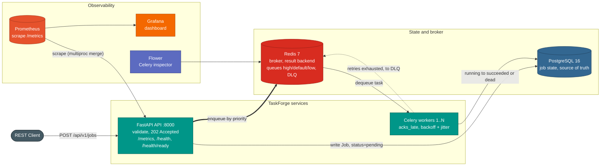

# TaskForge

Distributed background job processing system. A FastAPI service accepts jobs over REST and returns immediately; Celery workers execute them asynchronously, PostgreSQL tracks state, Redis brokers the queue, and Prometheus and Grafana provide observability.

[](https://github.com/JaithraSarma/TaskForge/actions/workflows/ci.yml)
[](LICENSE)

## Features

- Accepts jobs over a REST API and returns `202 Accepted` in milliseconds.
- At-least-once execution: jobs are not lost if a worker dies (late acking plus worker-loss redelivery).
- Automatic retries with exponential backoff and jitter.
- Priority routing across three queues (high, default, low).
- Dead-letter queue with inspect, retry, and purge endpoints.
- Prometheus metrics, a Grafana dashboard, and structured JSON logs with request correlation IDs.
- Ships as a Docker Compose stack and Kubernetes manifests with horizontal autoscaling.

## Architecture



The API validates the request, writes a `Job` row to PostgreSQL as `pending`, commits it, then publishes a task to Redis and returns `202`. Priority (1 to 10) maps to the `high` (1 to 3), `default` (4 to 7), or `low` (8 to 10) queue. A worker dequeues the task, runs the handler, and updates the row to `succeeded`, or retries with backoff and jitter until `max_retries` is exhausted and the job is dead-lettered. PostgreSQL is the source of truth; Redis holds in-flight messages and the dead-letter list.

Design decisions and the reasoning behind them are documented in [THEORY.md](THEORY.md).

## Tech stack

| Layer | Technology |
|---|---|
| API | FastAPI, Uvicorn, Pydantic v2 |
| Task queue | Celery 5, Redis 7 (broker, result backend, DLQ) |
| Database | PostgreSQL 16, SQLAlchemy 2.0 (asyncpg for the API, psycopg2 for workers), Alembic |
| Metrics | prometheus-client, Prometheus, Grafana |
| Monitoring UI | Flower |
| Packaging | Docker, Docker Compose, Kubernetes |
| CI/CD | GitHub Actions, GHCR, Trivy |
| Quality | ruff, mypy, pytest, pre-commit |

## Quick start

```bash
git clone https://github.com/JaithraSarma/TaskForge.git
cd TaskForge

cp .env.example .env
docker compose up -d --build
docker compose ps          # services should report healthy

pip install httpx
python scripts/seed_jobs.py
```

| Service | URL | Notes |
|---|---|---|
| API docs (Swagger) | http://localhost:8000/docs | interactive |
| API docs (ReDoc) | http://localhost:8000/redoc | |
| Grafana | http://localhost:3000 | login `admin` / `admin` |
| Prometheus | http://localhost:9090 | |
| Flower | http://localhost:5555 | Celery inspector |

[SETUP.md](SETUP.md) has a step-by-step runbook with expected output, local (non-Docker) development, tests, and troubleshooting.

## Configuration

Configuration is read from environment variables (see `.env.example`): database URLs, Redis and Celery URLs, retry parameters, CORS origins, and `LOG_LEVEL` / `LOG_FORMAT`. Use `LOG_FORMAT=console` for human-readable logs in local development.

## API reference

### Jobs

| Method | Endpoint | Description |
|---|---|---|
| `POST` | `/api/v1/jobs` | Submit a job (returns `202`) |
| `GET` | `/api/v1/jobs` | List jobs (paginated, filterable by `status` and `job_type`) |
| `GET` | `/api/v1/jobs/{id}` | Get job detail |
| `DELETE` | `/api/v1/jobs/{id}` | Cancel a job while still `pending` (`409` otherwise) |

### Dead-letter queue

| Method | Endpoint | Description |
|---|---|---|
| `GET` | `/api/v1/dlq` | List DLQ entries |
| `GET` | `/api/v1/dlq/{id}` | Inspect an entry (payload, error, retry count) |
| `POST` | `/api/v1/dlq/{id}/retry` | Reset to `pending` and re-enqueue |
| `DELETE` | `/api/v1/dlq/{id}` | Delete an entry |

### System

| Method | Endpoint | Description |
|---|---|---|
| `GET` | `/health` | Liveness (process up, no dependency checks) |
| `GET` | `/health/ready` | Readiness (checks PostgreSQL and Redis, `503` if either is down) |
| `GET` | `/metrics` | Prometheus exposition format |

### Example

```bash
curl -X POST http://localhost:8000/api/v1/jobs \
  -H "Content-Type: application/json" \
  -d '{
    "job_type": "email_notification",
    "payload": {"to": "user@example.com", "subject": "Hello"},
    "priority": 2,
    "max_retries": 5
  }'
```

```json
{
  "id": "a1b2c3d4-e5f6-7890-abcd-ef1234567890",
  "status": "pending",
  "message": "Job submitted successfully"
}
```

### Job types

Handlers in `worker/handlers.py` simulate work with a random failure rate so retries and the DLQ are exercised without external services.

| `job_type` | Simulated failure rate |
|---|---|
| `email_notification` | ~10% |
| `data_export` | ~5% |
| `image_resize` | ~8% |
| `webhook_delivery` | ~12% |

## Observability

Metrics are defined in `app/metrics.py` and exported at `/metrics`:

| Metric | Type | Labels | Meaning |
|---|---|---|---|
| `taskforge_jobs_submitted_total` | Counter | `job_type`, `priority` | Jobs accepted via the API |
| `taskforge_jobs_completed_total` | Counter | `job_type`, `status` | Jobs reaching a terminal state |
| `taskforge_jobs_retry_total` | Counter | `job_type` | Retry attempts |
| `taskforge_job_duration_seconds` | Histogram | `job_type` | Time from running to terminal state |
| `taskforge_queue_depth` | Gauge | `queue_name` | Jobs waiting per queue (read from the broker) |
| `taskforge_dlq_size` | Gauge | | Current DLQ entry count |
| `taskforge_active_workers` | Gauge | | Live worker processes |

Standard HTTP request metrics are added automatically. The Grafana dashboard (`monitoring/grafana/dashboards/taskforge.json`) covers throughput, queue health, latency, failures and retries, and HTTP endpoints. Logs are single-line JSON carrying a `request_id` that ties an API request to the worker that ran the job.

## Kubernetes

`k8s/` contains manifests mirroring the compose topology: an API Deployment (2 replicas, autoscaled by an HPA on CPU), a worker Deployment, a Postgres StatefulSet, a Redis Deployment, a ConfigMap and Secret, and probes wired to the health endpoints. See [k8s/README.md](k8s/README.md) for prerequisites and apply order.

```bash
docker build -t taskforge:latest .
kubectl apply -f k8s/
kubectl -n taskforge port-forward svc/taskforge-api 8000:8000
```

## Development

```bash
make install      # install dependencies
make up           # start the stack
make test         # run the test suite
make lint         # ruff check
make typecheck    # mypy
make seed         # one job of each type
make load-test    # concurrent load
make down         # stop the stack
```

Run `make help` for the full list.

## Testing and CI/CD

Tests run with pytest against SQLite and an in-memory broker. CI (`.github/workflows/ci.yml`) runs ruff, mypy, and the test suite with a coverage floor on every push and pull request, plus a Docker build. CD (`.github/workflows/cd.yml`) publishes the image to GHCR and scans it with Trivy. The same lint and type checks run locally via `.pre-commit-config.yaml` (`pre-commit install`).

## Project structure

```
taskforge/
├── app/                # FastAPI service (api, config, database, metrics, logging, models, schemas)
├── worker/             # Celery app, tasks, handlers, signals
├── migrations/         # Alembic migrations
├── monitoring/         # Prometheus config, Grafana dashboard
├── k8s/                # Kubernetes manifests
├── scripts/            # seed and load-test scripts
├── tests/              # pytest suite
├── docker-compose.yml
├── Dockerfile
├── THEORY.md           # design, reliability, and reference guide
└── SETUP.md            # step-by-step runbook
```

## Documentation

- [THEORY.md](THEORY.md): architecture, design decisions, file-by-file reference, and reliability details.
- [SETUP.md](SETUP.md): setup runbook, local development, and troubleshooting.
- [k8s/README.md](k8s/README.md): Kubernetes deployment.

## License

MIT. See [LICENSE](LICENSE).
